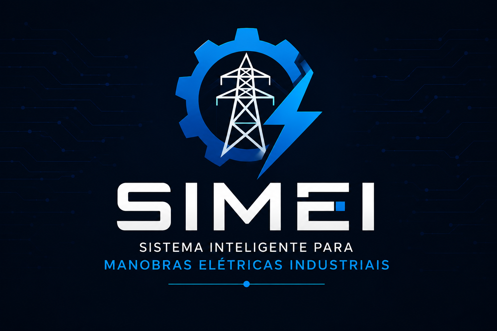

  

<h1 align="center">SIMEI</h1>

<b>Sistema Inteligente para Manobras Elétricas Industriais</b>

**Versão 0.1.0** • 🚧 Em desenvolvimento

---

# 📖 Visão Geral

O **SIMEI (Sistema Inteligente para Manobras Elétricas Industriais)** é uma plataforma didática destinada ao treinamento de procedimentos operacionais em instalações elétricas industriais.

O projeto busca proporcionar um ambiente seguro para aprendizagem, permitindo que operadores executem sequências de manobra, compreendam a lógica dos intertravamentos elétricos e recebam feedback imediato sobre suas ações, sem qualquer interferência em instalações reais.

---

# ⚠ O Problema

O treinamento de manobras em instalações elétricas normalmente apresenta limitações relacionadas à disponibilidade da instalação, aos requisitos de segurança e ao acompanhamento de profissionais experientes.

Esses fatores reduzem as oportunidades de treinamento prático e dificultam o desenvolvimento da experiência operacional necessária para a execução segura dos procedimentos.

---

# 💡 A Solução

O SIMEI reproduz cenários operacionais utilizando uma arquitetura composta por uma bancada didática integrada a uma Interface Homem-Máquina Supervisória (IHM).

Durante a simulação, o sistema acompanha cada operação executada, valida automaticamente a sequência das manobras, identifica inconsistências operacionais e fornece feedback em tempo real ao operador.

---

# 🎯 Objetivos

- Simular procedimentos operacionais em instalações elétricas industriais;
- Auxiliar na capacitação técnica de operadores;
- Validar sequências de manobra;
- Demonstrar a lógica dos intertravamentos elétricos;
- Proporcionar treinamento prático em ambiente seguro;
- Permitir a expansão para novos cenários operacionais.

---

# ⚙ Funcionalidades

- Simulação de procedimentos operacionais;
- Validação automática da sequência de manobras;
- Sistema de intertravamentos lógicos;
- Identificação de erros operacionais;
- Alarmes sonoros;
- Feedback operacional em tempo real;
- Interface Homem-Máquina Supervisória (IHM);
- Plataforma modular para expansão de novos cenários.

---

# 🏗 Arquitetura

O SIMEI foi concebido utilizando uma arquitetura modular composta por três camadas.

## Camada Física

Responsável pela representação dos equipamentos presentes na instalação elétrica através de dispositivos eletrônicos de sinalização e acionamento.

## Camada de Controle

Responsável pelo processamento da lógica operacional, validação das sequências de manobra, gerenciamento dos intertravamentos e tratamento das condições de erro.

## Camada de Supervisão

Responsável pela interação entre o operador e o sistema, fornecendo comandos, informações operacionais e feedback em tempo real através de uma Interface Homem-Máquina (IHM).

Essa arquitetura permite a evolução da plataforma sem alterar seu conceito de funcionamento.

---

# 🔧 Implementação Atual

A versão atual corresponde ao primeiro protótipo funcional da plataforma.

### Recursos implementados

- Controle lógico das manobras;
- Comunicação Serial;
- Interface textual de operação;
- Sistema de feedback operacional;
- Sistema de alarmes;
- Primeiro cenário de treinamento.

### Cenário implementado

Simulação da retirada de operação de um transformador de potência em uma subestação elétrica, utilizando validação automática das etapas da manobra e intertravamentos lógicos.

---

# 🚀 Roadmap

## Versão 1.0

Primeira implementação funcional da plataforma.

- Arquitetura inicial;
- Desenvolvimento do firmware;
- Interface Supervisória;
- Primeiro cenário operacional;
- Integração entre hardware e software.

---

## Versão 2.0

Expansão da plataforma.

- Plataforma modular;
- Múltiplos cenários de treinamento;
- Biblioteca de procedimentos operacionais;
- Registro das operações executadas;
- Histórico de treinamentos;
- Evolução da Interface Supervisória.

---

# 🛠 Tecnologias

## Conceitos Aplicados

- Sistemas Embarcados;
- Automação Industrial;
- Intertravamentos Elétricos;
- Procedimentos Operacionais;
- Interface Homem-Máquina (IHM);
- Comunicação Serial.

## Ferramentas de Desenvolvimento

- Linguagem C/C++;
- Git;
- GitHub;
- Arduino IDE;
- Tinkercad.

---

# 🚧 Status do Desenvolvimento

| Etapa | Status |
|---------------------------|:------:|
| Planejamento | ✅ |
| Arquitetura | ✅ |
| Documentação | ✅ |
| Firmware | 🚧 |
| Protótipo físico | ⏳ |
| Interface Supervisória | ⏳ |
| Testes | ⏳ |

**Legenda**

- ✅ Concluído
- 🚧 Em desenvolvimento
- ⏳ Planejado

---

# 📅 Histórico de Versões

| Versão | Descrição |
|---------|-----------|
| 0.1.0 | Estrutura inicial do projeto |
| 0.2.0 | Desenvolvimento do firmware |
| 0.3.0 | Primeiro protótipo funcional |
| 1.0.0 | Primeira versão operacional |
| 2.0.0 | Plataforma modular |

---

# 👨‍💻 Desenvolvedor

**Juan Augusto Budal Arins Teixeira**

Graduando em Engenharia Elétrica.

---

# 📄 Licença

Projeto em desenvolvimento para fins acadêmicos, pesquisa e demonstração tecnológica.